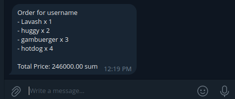

Interview Task Restaurant Food Ordering System backend
============================


Folder Structure Conventions
============================

> Folder structure options and naming conventions for the current project

### A typical top-level directory layout

    .
    ├── .envs                   # Environment veriables
    ├── compose                 # Docker files and bash commands
    ├── requirements            # Third party libraries
    ├── config                  # Project configuration files 
    ├── main                    # Project applicateions directory ('lib' or 'apps') 
    ├── local.yml               # docker-compose (running in local)
    ├── production.yml          # docker-compose (to deploy in production)
    └── README.md

### Outline

- Prerequisites
- Setup
    - Development
    - Production
- Documentation

## Prerequisites

> This project has the following prerequisites

- python 3.12.3
- docker 24.0.7
- docker-compose 1.29.2

### Setup (development)

> Install virtual environment (optional):

```
git clone git@github.com:akhaddev/interview_task.git
cd interview_task
python -m venv --prompt="v" .env
```

>If *pre commit* has not been installed please install by running following command (optional):

```
pip install pre-commit
pre-commmit install
```

> Type the command below to run the project locally:

```
docker-compose -f local.yml up -d --build
```

> Type the command below to stop containers:

```
docker-compose -f local.yml stop
```

> Type the command below to enter specific container:

```
docker exec -it <container_name> bin/bash
```

- You should be good to go now


### Setup (development)
 
 This is a telegram bot screenshot, all orders that are ordered by clients send to telegram bot to inform restaurant employees


